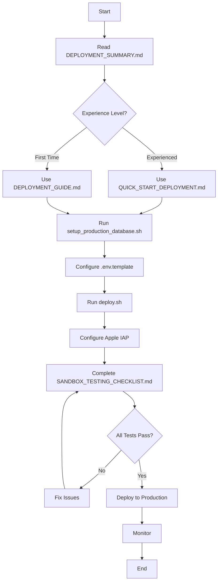

# LightGallery Deployment Documentation Index

## 📚 Complete Deployment Documentation

This index provides quick access to all deployment-related documentation for the LightGallery authentication and subscription system.

---

## 🎯 Start Here

### For Quick Deployment (Experienced Engineers)
👉 **[QUICK_START_DEPLOYMENT.md](QUICK_START_DEPLOYMENT.md)**
- Fast-track deployment guide (~1 hour)
- Essential commands and configurations
- Troubleshooting quick reference

### For First-Time Deployment
👉 **[DEPLOYMENT_SUMMARY.md](DEPLOYMENT_SUMMARY.md)**
- Overview of all deliverables
- Complete checklist
- Requirements validation
- Next steps

---

## 📖 Detailed Guides

### Backend Deployment
📄 **[backend/DEPLOYMENT_GUIDE.md](backend/DEPLOYMENT_GUIDE.md)** (19 KB)
- Complete backend deployment guide
- Production database configuration
- Environment variable setup
- SSL/TLS configuration
- Monitoring and maintenance
- Security best practices
- Troubleshooting guide
- Rollback procedures

**Sections**:
1. Production Database Configuration
2. Environment Variables Configuration
3. SSL/TLS Configuration
4. Apple IAP Production Configuration
5. Sandbox Testing
6. Deployment Checklist
7. Monitoring and Maintenance
8. Troubleshooting
9. Security Best Practices
10. Rollback Procedure

---

### iOS Deployment
📄 **[IOS_IAP_DEPLOYMENT_GUIDE.md](IOS_IAP_DEPLOYMENT_GUIDE.md)** (17 KB)
- Complete iOS IAP setup guide
- App Store Connect configuration
- Xcode project configuration
- Sandbox testing procedures
- Production deployment steps
- Monitoring and analytics

**Sections**:
1. App Store Connect Configuration
2. Xcode Project Configuration
3. Sandbox Testing Setup
4. Sandbox Testing Procedures (10 test cases)
5. Production Deployment
6. Testing Checklist
7. Troubleshooting
8. Monitoring and Analytics
9. Support and Resources
10. Common Issues and Solutions

---

## 🛠️ Configuration Files

### Environment Variables Template
📄 **[backend/.env.template](backend/.env.template)** (4 KB)
- Template for all environment variables
- Database configuration
- JWT secret
- OAuth credentials (WeChat, Alipay, Apple)
- Apple IAP configuration
- SSL/TLS settings
- CORS configuration

**Usage**:
```bash
sudo cp backend/.env.template /etc/lightgallery/production.env
sudo nano /etc/lightgallery/production.env
sudo chmod 600 /etc/lightgallery/production.env
```

---

## 🤖 Automation Scripts

### Backend Deployment Script
📄 **[backend/deploy.sh](backend/deploy.sh)** (8 KB, executable)
- Automated backend deployment
- Prerequisites checking
- Application building
- Service configuration
- Automatic startup

**Usage**:
```bash
cd backend
sudo ./deploy.sh
```

**Features**:
- ✅ Checks Java, Maven, MySQL
- ✅ Creates directories and users
- ✅ Builds application
- ✅ Backs up existing deployment
- ✅ Deploys new version
- ✅ Configures systemd service
- ✅ Sets up log rotation
- ✅ Starts and verifies service

---

### Database Setup Script
📄 **[backend/setup_production_database.sh](backend/setup_production_database.sh)** (10 KB, executable)
- Interactive database setup
- Secure credential generation
- Schema creation
- Backup configuration

**Usage**:
```bash
cd backend
sudo ./setup_production_database.sh
```

**Features**:
- ✅ Prompts for database credentials
- ✅ Tests database connection
- ✅ Creates database and user
- ✅ Generates strong passwords
- ✅ Runs schema script
- ✅ Verifies tables and indexes
- ✅ Saves credentials securely
- ✅ Sets up automated backups

---

## ✅ Testing Documentation

### Sandbox Testing Checklist
📄 **[SANDBOX_TESTING_CHECKLIST.md](SANDBOX_TESTING_CHECKLIST.md)** (18 KB)
- Comprehensive testing checklist
- 40 detailed test cases
- 10 test suites
- Sign-off section

**Test Suites**:
1. Product Loading (2 tests)
2. Purchase Flow (4 tests)
3. Receipt Verification (1 test)
4. Subscription Management (4 tests)
5. Upgrade/Downgrade (3 tests)
6. Feature Access Control (3 tests)
7. Offline Mode (3 tests)
8. Error Handling (4 tests)
9. UI/UX Testing (3 tests)
10. Localization (2 tests)

**Usage**:
- Print and use as physical checklist
- Complete all tests before production
- Get QA sign-off
- Document any issues

---

## 📊 Summary Documents

### Deployment Summary
📄 **[DEPLOYMENT_SUMMARY.md](DEPLOYMENT_SUMMARY.md)** (12 KB)
- Complete task summary
- All deliverables listed
- Requirements validation
- Deployment checklist
- Key configuration values
- Testing summary
- Security considerations
- Next steps

---

## 🗂️ Documentation Structure

```
LightGallery/
│
├── 📄 DEPLOYMENT_INDEX.md              ← You are here
├── 📄 DEPLOYMENT_SUMMARY.md            ← Start here for overview
├── 📄 QUICK_START_DEPLOYMENT.md        ← Fast-track guide
├── 📄 IOS_IAP_DEPLOYMENT_GUIDE.md      ← iOS deployment
├── 📄 SANDBOX_TESTING_CHECKLIST.md     ← Testing checklist
│
└── backend/
    ├── 📄 DEPLOYMENT_GUIDE.md          ← Backend deployment
    ├── 📄 .env.template                ← Environment variables
    ├── 🤖 deploy.sh                    ← Deployment script
    └── 🤖 setup_production_database.sh ← Database setup script
```

---

## 🚀 Deployment Workflow

### Step-by-Step Process



### Quick Reference

| Step | Document | Time | Command |
|------|----------|------|---------|
| 1. Database | setup_production_database.sh | 5 min | `sudo ./setup_production_database.sh` |
| 2. Environment | .env.template | 5 min | `sudo nano /etc/lightgallery/production.env` |
| 3. Deploy | deploy.sh | 5 min | `sudo ./deploy.sh` |
| 4. iOS Setup | IOS_IAP_DEPLOYMENT_GUIDE.md | 15 min | Manual in App Store Connect |
| 5. Testing | SANDBOX_TESTING_CHECKLIST.md | 30 min | Manual testing |
| **Total** | | **~1 hour** | |

---

## 📋 Pre-Deployment Checklist

Before starting deployment, ensure you have:

### Infrastructure
- [ ] Production server with root access
- [ ] MySQL 8.0+ database server
- [ ] Domain name configured (api.lightgallery.app)
- [ ] SSL certificate obtained
- [ ] Firewall rules configured

### Software
- [ ] Java 17+ installed
- [ ] Maven 3.6+ installed
- [ ] MySQL client installed
- [ ] Git installed

### Credentials
- [ ] Apple Developer Account
- [ ] App Store Connect access
- [ ] WeChat Open Platform credentials
- [ ] Alipay Open Platform credentials
- [ ] Apple OAuth credentials
- [ ] Database admin credentials

### Documentation
- [ ] Read DEPLOYMENT_SUMMARY.md
- [ ] Choose deployment guide (Quick Start or Full)
- [ ] Print SANDBOX_TESTING_CHECKLIST.md
- [ ] Review security best practices

---

## 🔧 Common Tasks

### View Backend Logs
```bash
journalctl -u lightgallery-backend -f
```

### Restart Backend Service
```bash
sudo systemctl restart lightgallery-backend
```

### Check Service Status
```bash
sudo systemctl status lightgallery-backend
```

### Test Health Endpoint
```bash
curl https://api.lightgallery.app/api/v1/health
```

### Database Backup
```bash
/usr/local/bin/backup-lightgallery-db.sh
```

### View Database Credentials
```bash
sudo cat /etc/lightgallery/database.credentials
```

---

## 🆘 Troubleshooting

### Quick Fixes

**Backend won't start**:
```bash
journalctl -u lightgallery-backend -n 50
```

**Database connection fails**:
```bash
mysql -h $DB_HOST -u $DB_USERNAME -p$DB_PASSWORD -e "SELECT 1"
```

**SSL certificate issues**:
```bash
openssl s_client -connect api.lightgallery.app:8080 -showcerts
```

**Products not loading**:
- Wait 24 hours after creating products
- Verify product IDs match App Store Connect
- Check products are "Ready to Submit"

### Detailed Troubleshooting
See section 8 in [DEPLOYMENT_GUIDE.md](backend/DEPLOYMENT_GUIDE.md#8-troubleshooting)

---

## 📞 Support

### Documentation
- Backend: [DEPLOYMENT_GUIDE.md](backend/DEPLOYMENT_GUIDE.md)
- iOS: [IOS_IAP_DEPLOYMENT_GUIDE.md](IOS_IAP_DEPLOYMENT_GUIDE.md)
- Testing: [SANDBOX_TESTING_CHECKLIST.md](SANDBOX_TESTING_CHECKLIST.md)

### External Resources
- [Apple IAP Documentation](https://developer.apple.com/in-app-purchase/)
- [StoreKit Documentation](https://developer.apple.com/documentation/storekit)
- [Spring Boot Documentation](https://spring.io/projects/spring-boot)
- [MySQL Documentation](https://dev.mysql.com/doc/)

### Internal Contacts
- Technical Lead: [To be filled]
- DevOps Team: [To be filled]
- QA Team: [To be filled]

---

## 📝 Document Versions

| Document | Version | Last Updated | Size |
|----------|---------|--------------|------|
| DEPLOYMENT_INDEX.md | 1.0 | Dec 7, 2024 | - |
| DEPLOYMENT_SUMMARY.md | 1.0 | Dec 7, 2024 | 12 KB |
| QUICK_START_DEPLOYMENT.md | 1.0 | Dec 7, 2024 | 7 KB |
| DEPLOYMENT_GUIDE.md | 1.0 | Dec 7, 2024 | 19 KB |
| IOS_IAP_DEPLOYMENT_GUIDE.md | 1.0 | Dec 7, 2024 | 17 KB |
| SANDBOX_TESTING_CHECKLIST.md | 1.0 | Dec 7, 2024 | 18 KB |
| .env.template | 1.0 | Dec 7, 2024 | 4 KB |
| deploy.sh | 1.0 | Dec 7, 2024 | 8 KB |
| setup_production_database.sh | 1.0 | Dec 7, 2024 | 10 KB |

**Total Documentation**: ~95 KB

---

## ✅ Task Completion

**Task 29: 准备部署 (Prepare Deployment)** - ✅ COMPLETED

### Deliverables
- ✅ Production database configuration guide
- ✅ Environment variable setup with templates
- ✅ Apple IAP production configuration guide
- ✅ Sandbox testing procedures and checklist
- ✅ Automated deployment scripts
- ✅ Security best practices documentation
- ✅ Monitoring and maintenance procedures
- ✅ Troubleshooting guides
- ✅ Rollback procedures

### Requirements Satisfied
- ✅ Requirement 4.1: Apple IAP purchase flow configuration
- ✅ Requirement 4.2: Receipt verification setup

---

**Status**: READY FOR DEPLOYMENT 🚀

**Last Updated**: December 7, 2024  
**Maintained By**: LightGallery Development Team
